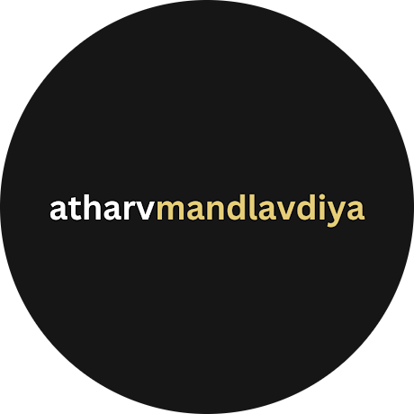

<div align="center">
  


### Atharv Mandlavdiya

**Student@AISG46 | Core Member@RoboNexus | Member@TechSyndicate | Co-Founder@FirstCommit | Cybersecurity /\​ Developer**

<br>

[](https://atharvmandlavdiya.is-a.dev)
[](https://linkedin.com/in/atharvmandlavdiya)
[](https://www.hackerrank.com/profile/Atharv0M)
[](https://g.dev/atharvmandlavdiya)
[](https://itch.io/profile/atharvam)

</div>

---

```
                                                    atharvm@github
         ,gPPRg,                                    ---------------
      ,@P''   'Y@,             @@                   OS: ..................... Class 10 Student, India
    ,@P'  @@@@@g '@,         g@@@M                  Uptime: ................. 15 years, coding since 2020
   ,@P' ,@P"````YM '@,     ,@P" R@                  Host: ................... Amity Intl School, Gurugram
  ,@P  @P'       `Rg '@   ,@P    `@L                Kernel: ................. MacBook Pro '17 (Iris 640)
  @P' ]@@          l@g`@ ,@P      `@L               IDE: .................... VS Code 1.96.6, Claude, Copilot
,@L    g@@@@@@@@g    l@@@M@        R@
P@P'    ]@@WWWW@@L    l@@@  @    @  @@              Languages.Programming: ... Python, TypeScript, JavaScript, C++, C#
@@L      ]@P  `R@     ]@P  'M@@@@@M' ]@             Languages.Computer: ...... HTML, CSS, JSON, LaTeX, YAML
@@L       @,   ]@     '@       @@    '@@            Languages.Real: .......... English, Hindi
P@P'      '@ggg@P      R@     ,@P    ,@P
`R@g        '^^'       ,@P    ,@P    ,@P            Hobbies.Software: ....... Full-Stack Dev, Web3, Cybersecurity
  `@L                 ,@P  '@@@@@@@@@@P             Hobbies.Hardware: ....... Arduino, ESP32, PCB Design
   `@L               ,@P   ,@P    ,@@'
    `@@g           ,@@P  ,@@P    ,@P'               Contact:
      "R@g,     ,g@P'   ,@P     ,@P                 Email.Personal: ......... atharvam682@gmail.com
        `"MPRgPP"'     ,@P  ,@@@@@'                 Email.Work: ............. AtharvM@robonexusindia.tech
                      ,@P  ,@P                      LinkedIn: ............... in/atharvmandlavdiya
          @@@@@@@@@@  ,@P ,@P                       Discord: ................ atharvmandlavdiya
                     ,@P  @P                        Website: ................ atharvmandlavdiya.is-a.dev
                    '@@@ @@@
                     ````                           GitHub Stats
                                                    Repos: .... 53 (Contributed: 133) | Stars: .......... 342
                                                    Commits: .......... 1,116 | Followers: ........... 196
                                                    Lines of Code on GitHub: 446,276 ( 523,178++, 76,902-- )
```

<div align="center">

### Recent Activity

<!--START_SECTION:activity-->
1. 🎉 Merged PR [#16](https://github.com/RoboNexxus/RN-Website/pull/16) in [RoboNexxus/RN-Website](https://github.com/RoboNexxus/RN-Website)
2. 💪 Opened PR [#16](https://github.com/RoboNexxus/RN-Website/pull/16) in [RoboNexxus/RN-Website](https://github.com/RoboNexxus/RN-Website)
3. 🔒 Closed issue [#13](https://github.com/RoboNexxus/RN-Website/issues/13) in [RoboNexxus/RN-Website](https://github.com/RoboNexxus/RN-Website)
<!--END_SECTION:activity-->

<sub>stats updated via GitHub Actions</sub>

</div>
